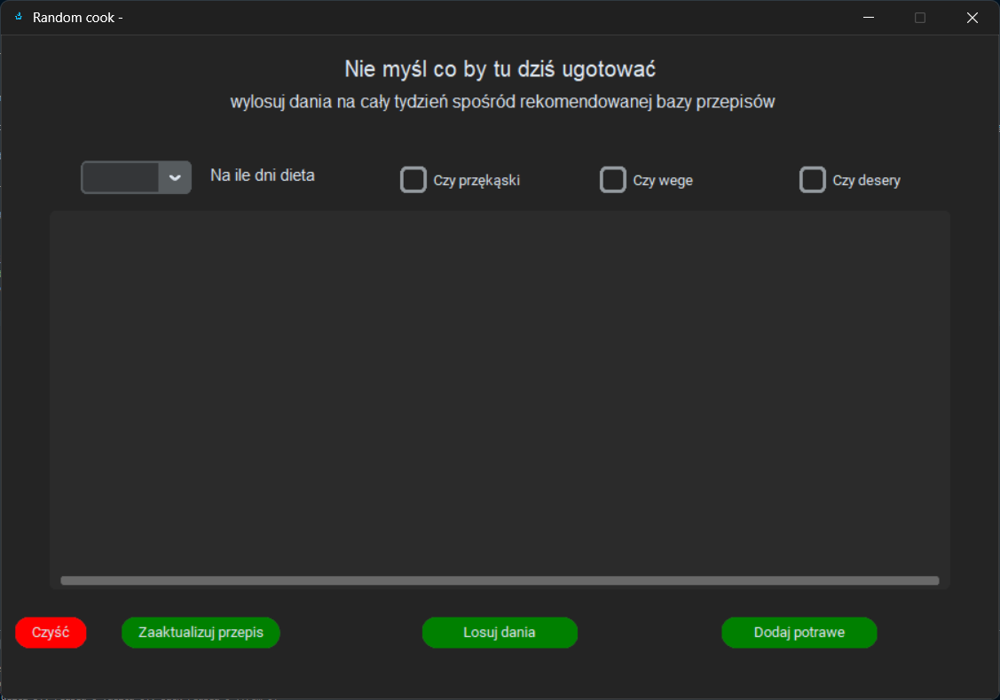

# Random Cook

Random Cook is a desktop application built in Python that helps users automatically generate meal plans based on their personal database of favorite dishes.
It ask a basic daily question: <br>
👉 _„What I eat today ?”_

The application eliminates repetitive decision-making by generating structured meal plans for 1 to 7 days without repeating meals.

This project demonstrates database integration, algorithmic logic, and GUI development.

---

<p align="center">
  
</p>

---

## 🚀 Features

- Randomized meal selection from a MongoDB database
- Meal planning from 1 to 7 days
- No repeated meals within a generated plan
- Configurable number of meals per day (3–5)
- Optional inclusion of snacks and desserts
- PDF export of the generated meal plan
- User-defined meal database

---

## 🧩 How It Works

1. The user stores meals in a MongoDB database.
2. The user selects:
   - number of days (1–7),
   - number of meals per day,
   - optional categories (e.g., snacks or desserts).
3. The application generates a randomized meal plan.
4. Meals are selected without repetition.
5. The final plan is exported as a PDF file.

The application separates business logic (meal generation algorithm) from the GUI layer to maintain clarity and maintainability.

---

## 🛠 Tech Stack

- Python
- MongoDB
- pymongo (database communication)
- random module (selection logic)
- tkinter
- customtkinter (modern UI styling)
- PDF generation library

---

# 🧠 What I learned

This project explores my algorithmic thinking through the design and implementation of the core meal selection algorithm architecture.

It was developed as part of a college MongoDB course and helped me gain practical experience working with MongoDB, including database design and integration using PyMongo.

Additionally, I learned how to handle and process PDF files in Python.

---

## Demo

video

## 📦 Installation & Running

```bash
git clone https://github.com/your-username/random-cook.git
cd random-cook
python main.py
```
